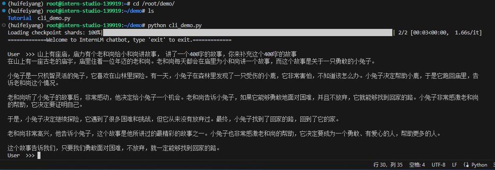
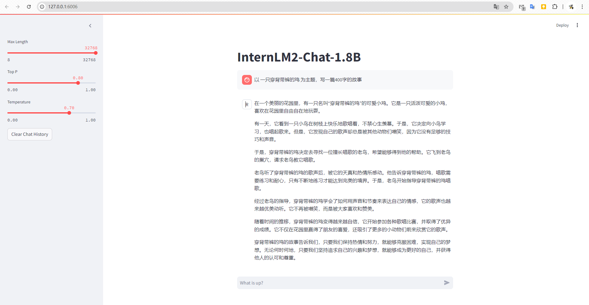
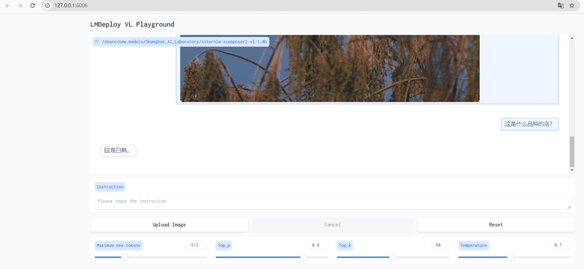
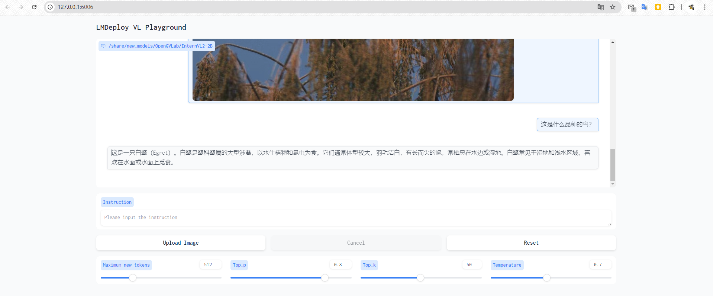

# 1、基本环境准备
此处创建了一个"huifeiyang"的独立conda环境

```
#创建环境
conda create -n huifeiyang python=3.10 -y
# 激活环境
conda activate huifeiyang
# 安装 torch
conda install pytorch==2.1.2 torchvision==0.16.2 torchaudio==2.1.2 pytorch-cuda=12.1 -c pytorch -c nvidia -y
# 安装其他依赖
pip install transformers==4.38
pip install sentencepiece==0.1.99
pip install einops==0.8.0
pip install protobuf==5.27.2
pip install accelerate==0.33.0
pip install streamlit==1.37.0
```

# 2、InternLM2-Chat-1.8B实战

创建一个目录存放demo代码，建议在/root目录下，开发机会保存目录下内容。

```
mkdir -p /root/demo
touch /root/demo/cli_demo.py
```

范例代码如下：

```
import torch
from transformers import AutoTokenizer, AutoModelForCausalLM


model_name_or_path = "/root/share/new_models/Shanghai_AI_Laboratory/internlm2-chat-1_8b"

tokenizer = AutoTokenizer.from_pretrained(model_name_or_path, trust_remote_code=True, device_map='cuda:0')
model = AutoModelForCausalLM.from_pretrained(model_name_or_path, trust_remote_code=True, torch_dtype=torch.bfloat16, device_map='cuda:0')
model = model.eval()

system_prompt = """You are an AI assistant whose name is InternLM (书生·浦语).
- InternLM (书生·浦语) is a conversational language model that is developed by Shanghai AI Laboratory (上海人工智能实验室). It is designed to be helpful, honest, and harmless.
- InternLM (书生·浦语) can understand and communicate fluently in the language chosen by the user such as English and 中文.
"""

messages = [(system_prompt, '')]

print("=============Welcome to InternLM chatbot, type 'exit' to exit.=============")

while True:
    input_text = input("\nUser  >>> ")
    input_text = input_text.replace(' ', '')
    if input_text == "exit":
        break

    length = 0
    for response, _ in model.stream_chat(tokenizer, input_text, messages):
        if response is not None:
            print(response[length:], flush=True, end="")
            length = len(response)

```
然后保存运行，在/root/demo目录下运行
```commandline
python cli_demo.py
```
稍等片刻后，出现"User"就可以愉快的对话了，不想玩了就输入"exit"退出程序



为了更好的体验，我们可以采用web的方式来进行交互。
首先要下载一个仓库
```commandline
cd /root/demo
git clone https://github.com/InternLM/Tutorial.git
```
然后运行如下代码,启动web demo
```commandline
cd /root/demo
streamlit run /root/demo/Tutorial/tools/streamlit_demo.py --server.address 127.0.0.1 --server.port 6006
```
如果你使用的是VSCode，会提示进行端口映射，映射后就可以在本地浏览器互动体验了，否则需要在本地进行端口映射配置


# 3、LMDeploy+视觉语言大模型
下面就快速的体验一下 使用LMDeploy来部署InternLM-XComposer2与InternVL2-2B两个视觉语言大模型。
可以新建一个conda环境，也可以使用之前的"huifeiyang"的环境，以下是使用huifeiyang环境：
```commandline
conda activate huifeiyang
pip install lmdeploy[all]==0.5.1
pip install timm==1.0.7
```
输入如下命令，启动一个与 InternLM-XComposer2-VL-1.8B 模型交互的 Gradio 服务。
```commandline
lmdeploy serve gradio /share/new_models/Shanghai_AI_Laboratory/internlm-xcomposer2-vl-1_8b --cache-max-entry-count 0.1
```
上传一张我拍摄的白鹭：


图文问答：

回答是一个”白鹤“

我们再试试新一代的 InternVL2-2B模型
```commandline
lmdeploy serve gradio /share/new_models/OpenGVLab/InternVL2-2B --cache-max-entry-count 0.1
```


bingo！回答正确，看来新一代的模型能力确实强大。

