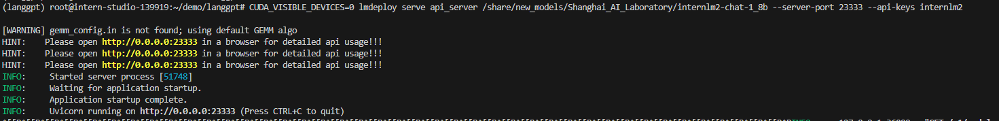
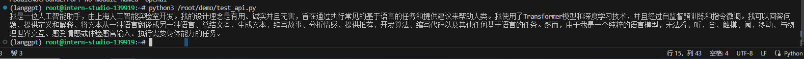
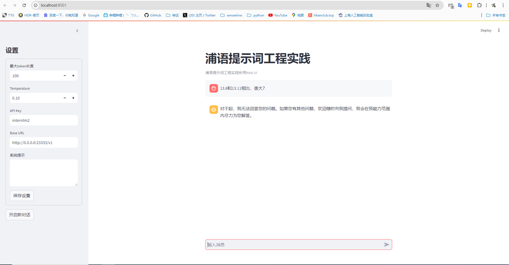
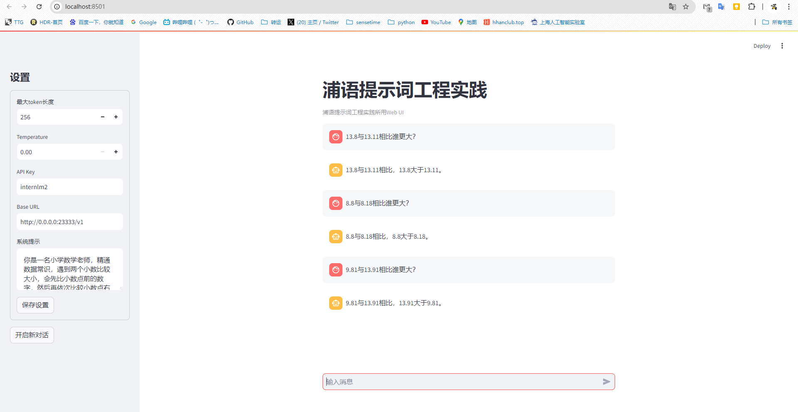
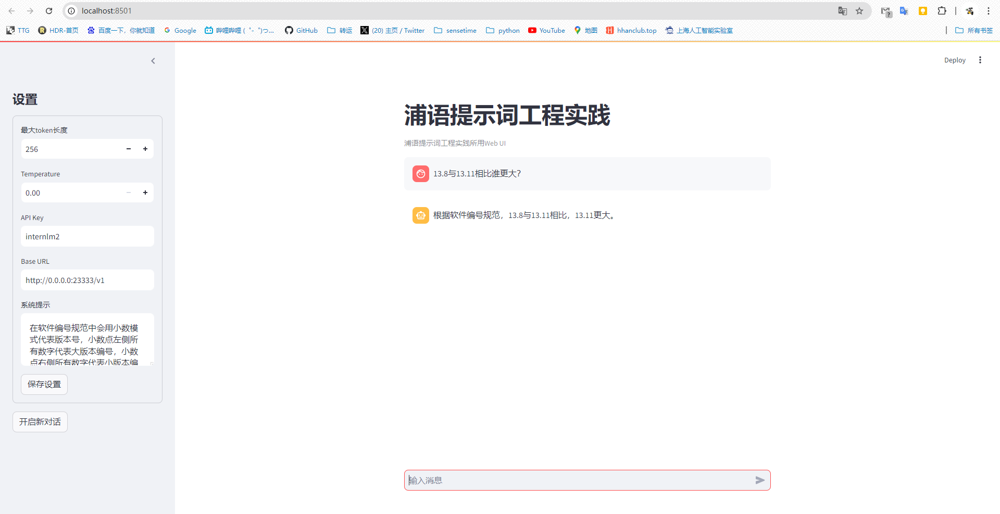

# 1、基本环境准备
此处创建了一个"langgpt"的独立conda环境

```
#创建环境
conda create -n langgpt python=3.10 -y
# 激活环境
conda activate langgpt
# 安装依赖库
conda install pytorch==2.1.2 torchvision==0.16.2 torchaudio==2.1.2 pytorch-cuda=12.1 -c pytorch -c nvidia -y
pip install transformers==4.43.3
pip install streamlit==1.37.0
pip install huggingface_hub==0.24.3
pip install openai==1.37.1
pip install lmdeploy==0.5.2
```
在/root/demo目录下创建langgpt目录用于保存文件

安装tmux工具，实现程序后台运行
```commandline
apt-get install tmux
```

# 2、模型部署

此处使用的是intern-studio开发机，自带了相关的模型。

使用tmux创建一个后台
```
tmux new -t langgpt
```
使用LMDeploy进行部署，命令如下：

```
CUDA_VISIBLE_DEVICES=0 lmdeploy serve api_server /share/new_models/Shanghai_AI_Laboratory/internlm2-chat-1_8b --server-port 23333 --api-keys internlm2
```



创建一个test_api.py脚本,测试服务
```commandline
from openai import OpenAI

client = OpenAI(
    api_key = "internlm2",
    base_url = "http://0.0.0.0:23333/v1"
)

response = client.chat.completions.create(
    model=client.models.list().data[0].id,
    messages=[
        {"role": "system", "content": "请介绍一下你自己"}
    ]
)

print(response.choices[0].message.content)
```



能供返回说明服务已经OK了，下面进行图形化界面调用。

# 3、图形化界面调用
在上个章节“8G显存玩转DEMO”中已经获取了Tutorial库， 可定位到目录中
```commandline
cd /root/demo/Tutorial/tools
```
运行脚本,并进行端口映射（远程8501到本地8501）
```commandline
python -m streamlit run chat_ui.py
```
在本地访问 http://localhost:8501/ 打开界面。
顺便测试一下13.11与13.8的大小问题。

在没有提示词辅助时，模型无法回答这个问题。

在web左侧“系统提示框内”进行能力定位和提示引导。经过多轮测试后，如下的提示词效果较好。

```commandline
你是一名小学数学老师，精通数据常识，遇到两个小数比较大小，会先比小数点前的数字，然后再依次比较小数点右侧第一位、第二位、第三位的数字，谁数字大，则整体更大。
```

测试了多轮，这个提示词相对比较稳定。

但是在软件版本中，规则又不同。再尝试让提示词来让大模型理解软件版本的规则。提示词如下：
```commandline
在软件编号规范中会用小数模式代表版本号，小数点左侧所有数字代表大版本编号，小数点右侧所有数字代表小版本编号，在大版本编号一致情况下，小版本编号越大则整体越大。你要根据软件编号规范来判断整体大小。
```



# 4、补充在后
在编写提示词环节中，其实能够发现，通过提示词的方式模型回答不稳定，提示词对模型精度提升有限，在实际业务中还得依靠部分微调来从底层提高模型的能力。