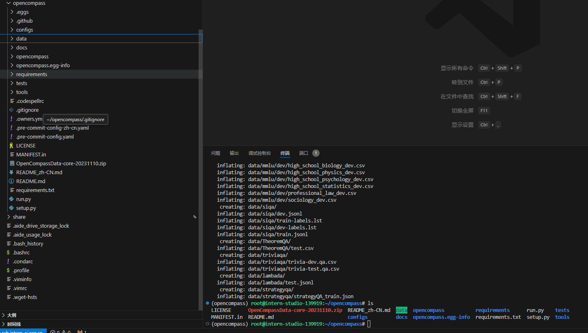
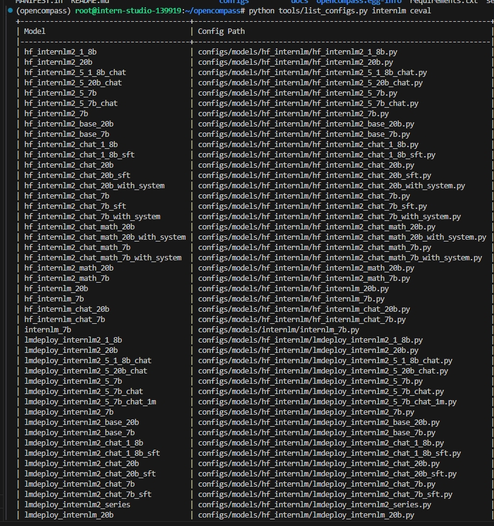
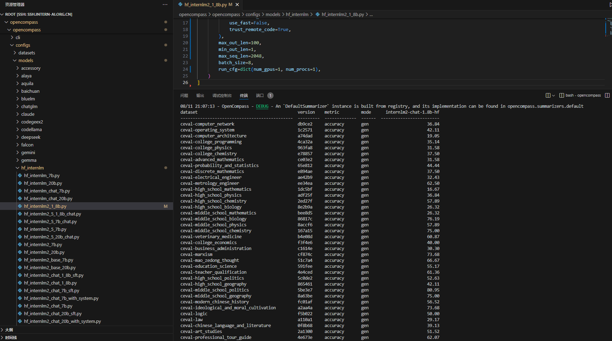

# 1、环境准备

注意开发机要配置成30%算力模式

独立部署一个conda环境，并安装资源
```commandline
# 创建虚拟环境
conda create -n opencompass python=3.10 -y

# 激活虚拟环境（注意：后续的所有操作都需要在这个虚拟环境中进行）
conda activate opencompass

# 从git下载库
cd /root
git clone https://github.com/open-compass/opencompass
cd opencompass
pip install -e .
```

# 2、模数据准备

从开发机默认位置复制一份测试数据，复制到opencompass目录下

```commandline
cp /root/share/temp/datasets/OpenCompassData-core-20231110.zip /root/opencompass/
unzip OpenCompassData-core-20231110.zip
```
在左侧预览可以看到如下：


# 3、测试脚本修改
首先可查阅支持的模型类型和对应的配置文件
```commandline
python tools/list_configs.py internlm ceval
```


我们此次要评测的是 hf_internlm2_chat_1_8b,
对应的配置文件为：configs/models/hf_internlm/hf_internlm2_chat_1_8b.py

在VScoded资源管理器中定位并打开文件，修改如下：
```commandline
from opencompass.models import HuggingFaceCausalLM


models = [
    dict(
        type=HuggingFaceCausalLM,
        abbr='internlm2-1.8b-hf',
        path="/share/new_models/Shanghai_AI_Laboratory/internlm2-chat-1_8b",
        tokenizer_path='/share/new_models/Shanghai_AI_Laboratory/internlm2-chat-1_8b',
        model_kwargs=dict(
            trust_remote_code=True,
            device_map='auto',
        ),
        tokenizer_kwargs=dict(
            padding_side='left',
            truncation_side='left',
            use_fast=False,
            trust_remote_code=True,
        ),
        max_out_len=100,
        min_out_len=1,
        max_seq_len=2048,
        batch_size=8,
        run_cfg=dict(num_gpus=1, num_procs=1),
    )
]
```

# 4、开始评测
设置环境变量
```commandline
export MKL_SERVICE_FORCE_INTEL=1
```
在opencompass目录下运行
```commandline
python run.py --datasets ceval_gen --models hf_internlm2_chat_1_8b --debug
```
等待运行评测


可以在opencompass的output目录下详细查看评测结果。