由于目前大模型存在很多能力边界，所以在实际工程中就需要借助其他“工具”来协同完成任务。
在这个场景下，LLM更多是起到分发任务、总结信息的功能。

Lagent 是一个轻量级开源智能体框架，旨在让用户可以高效地构建基于大语言模型的智能体。同时它也提供了一些典型工具以增强大语言模型的能力。

（以下会使用7B的模型，故建议使用16GB以上的显存搭建平台，其中文生图工具调用远程API接口，不需要考虑算力占用）

# 1、基本环境准备
此处创建了一个"agent_camp3"的独立conda环境

```
# 创建环境
conda create -n agent_camp3 python=3.10 -y
# 激活环境
conda activate agent_camp3
# 安装 torch
conda install pytorch==2.1.2 torchvision==0.16.2 torchaudio==2.1.2 pytorch-cuda=12.1 -c pytorch -c nvidia -y
# 安装其他依赖包
pip install termcolor==2.4.0
pip install lmdeploy==0.5.2
```
从git下载源码进行编译安装

```commandline
# 创建目录以存放代码
mkdir -p /root/agent_camp3
cd /root/agent_camp3
git clone https://github.com/InternLM/lagent.git
cd lagent && git checkout 81e7ace && pip install -e . && cd ..
```


# 2、LLM server 启动
在VScode新建一个终端，用来保活LLM server服务

```commandline
conda activate agent_camp3
lmdeploy serve api_server /share/new_models/Shanghai_AI_Laboratory/internlm2_5-7b-chat --model-name internlm2_5-7b-chat
```
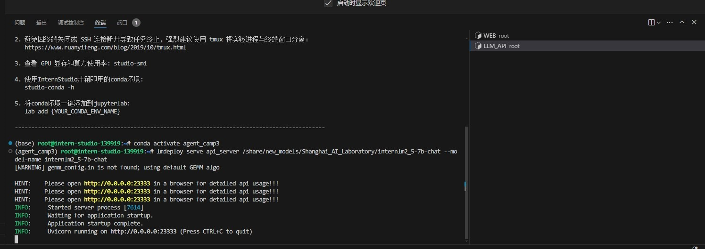

这个服务可一直开启不动，其中VScode会自动完成本地的端口映射。

# 3、WEB_server 启动

首先修改一处代码适配新版本
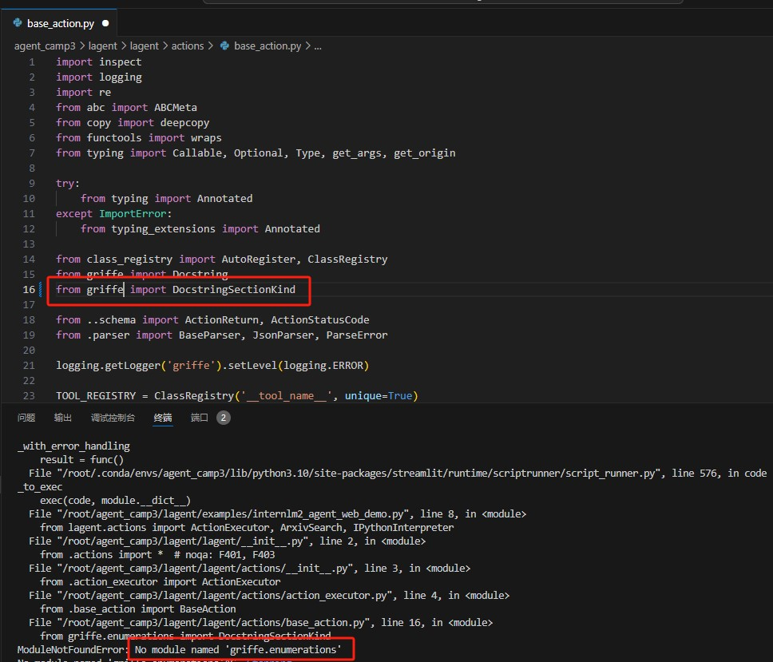

在另外一个终端进行web的启动

```commandline
cd /root/agent_camp3/lagent
conda activate agent_camp3
streamlit run examples/internlm2_agent_web_demo.py
```
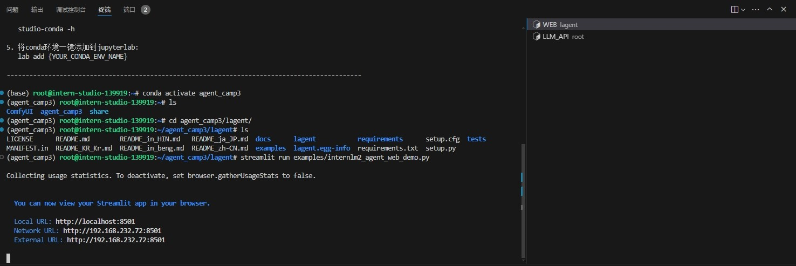

VScode会自动完成本地的端口映射

本地浏览器通过127.0.0.1:8501登录进入

# 4、测试Agent
模型名称一栏为 internlm2_5-7b-chat，修改模型 ip一栏为127.0.0.1:23333


默认DEMO激活了ArxivSearch插件。，先进行测试。

问题：ResNet的核心思想及创新点
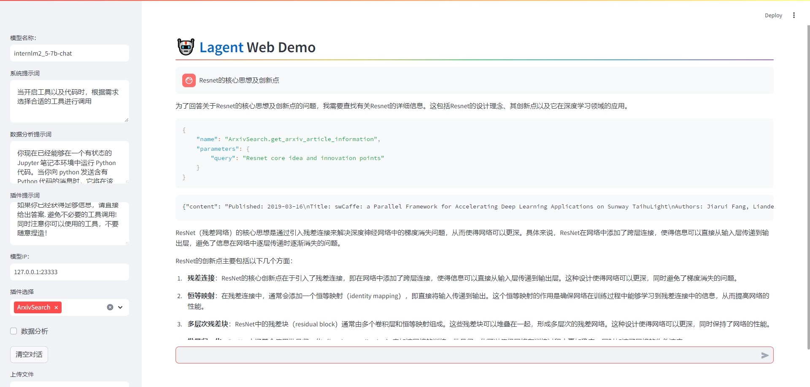
可以看到模型调用了ArxivSearch，检索到相关论文后，做了总结及回复。

# 5、自定义Agent
首先中止掉Web_server的服务（3中服务）

PS：Lagent 中关于工具部分的介绍文档位于 https://lagent.readthedocs.io/zh-cn/latest/tutorials/action.html 。

下面定义一个远程文生图的功能

创建工具文件：

```commandline
cd /root/agent_camp3/lagent
touch lagent/actions/magicmaker.py
```

复制如下代码
```commandline
import json
import requests

from lagent.actions.base_action import BaseAction, tool_api
from lagent.actions.parser import BaseParser, JsonParser
from lagent.schema import ActionReturn, ActionStatusCode


class MagicMaker(BaseAction):
    styles_option = [
        'dongman',  # 动漫
        'guofeng',  # 国风
        'xieshi',   # 写实
        'youhua',   # 油画
        'manghe',   # 盲盒
    ]
    aspect_ratio_options = [
        '16:9', '4:3', '3:2', '1:1',
        '2:3', '3:4', '9:16'
    ]

    def __init__(self,
                 style='guofeng',
                 aspect_ratio='4:3'):
        super().__init__()
        if style in self.styles_option:
            self.style = style
        else:
            raise ValueError(f'The style must be one of {self.styles_option}')
        
        if aspect_ratio in self.aspect_ratio_options:
            self.aspect_ratio = aspect_ratio
        else:
            raise ValueError(f'The aspect ratio must be one of {aspect_ratio}')
    
    @tool_api
    def generate_image(self, keywords: str) -> dict:
        """Run magicmaker and get the generated image according to the keywords.

        Args:
            keywords (:class:`str`): the keywords to generate image

        Returns:
            :class:`dict`: the generated image
                * image (str): path to the generated image
        """
        try:
            response = requests.post(
                url='https://magicmaker.openxlab.org.cn/gw/edit-anything/api/v1/bff/sd/generate',
                data=json.dumps({
                    "official": True,
                    "prompt": keywords,
                    "style": self.style,
                    "poseT": False,
                    "aspectRatio": self.aspect_ratio
                }),
                headers={'content-type': 'application/json'}
            )
        except Exception as exc:
            return ActionReturn(
                errmsg=f'MagicMaker exception: {exc}',
                state=ActionStatusCode.HTTP_ERROR)
        image_url = response.json()['data']['imgUrl']
        return {'image': image_url}
```
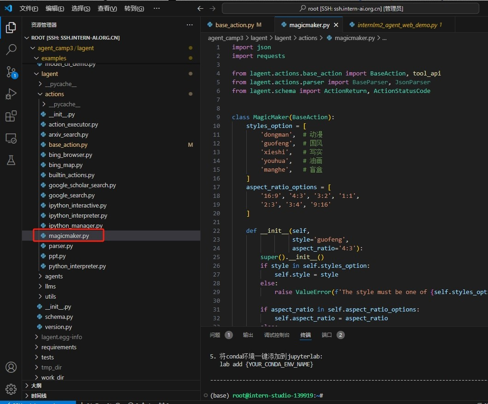

我们可以发现在目录内还提供了其他等工具能力。

修改 /root/agent_camp3/lagent/examples/internlm2_agent_web_demo.py 来适配我们的自定义工具

参考如下：
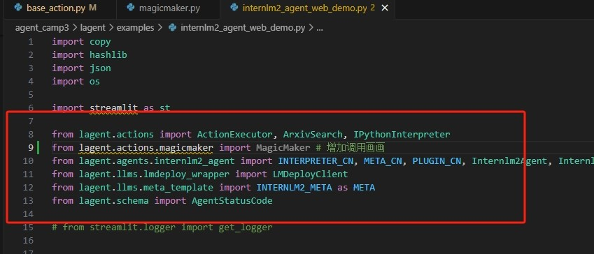

在下面同时增加MagicMaker()和IPythonInterpreter()

参考如下

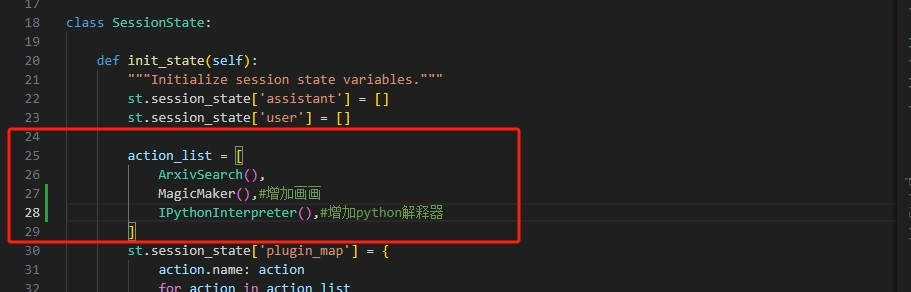

最后参考3，重新启动WEB_server。

# 6、测试自定义Agent

首先插件初增加三个插件。

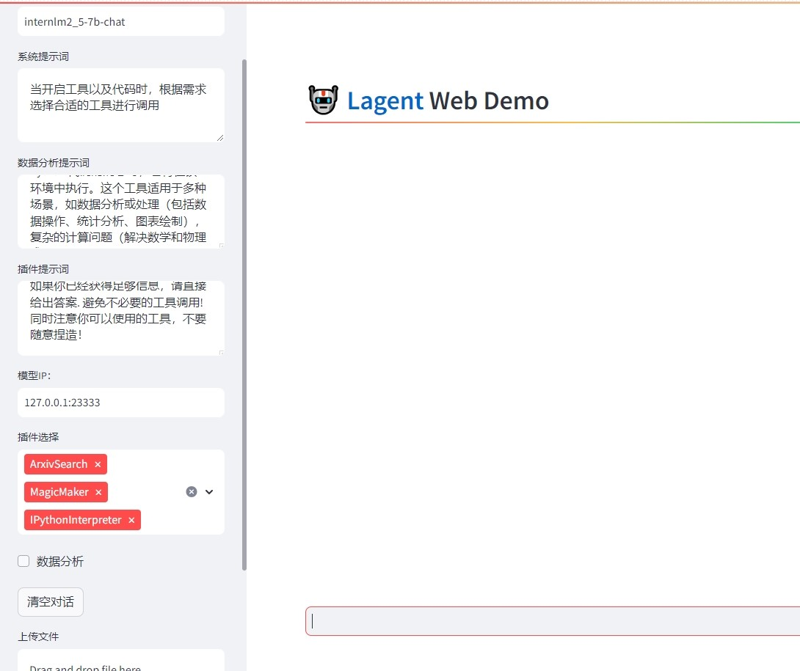

测试画画：

输入：画一张万马奔腾的水墨画

输出：
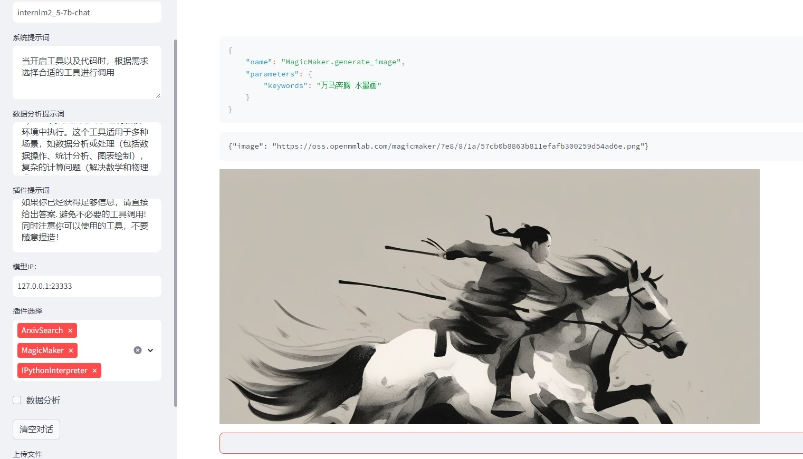

上传一个表格文件，统计分析

输入：表格中不合格的单位有多少？

输出：生成代码，尝试运行（系统缺少相关依赖，但说明在调用）
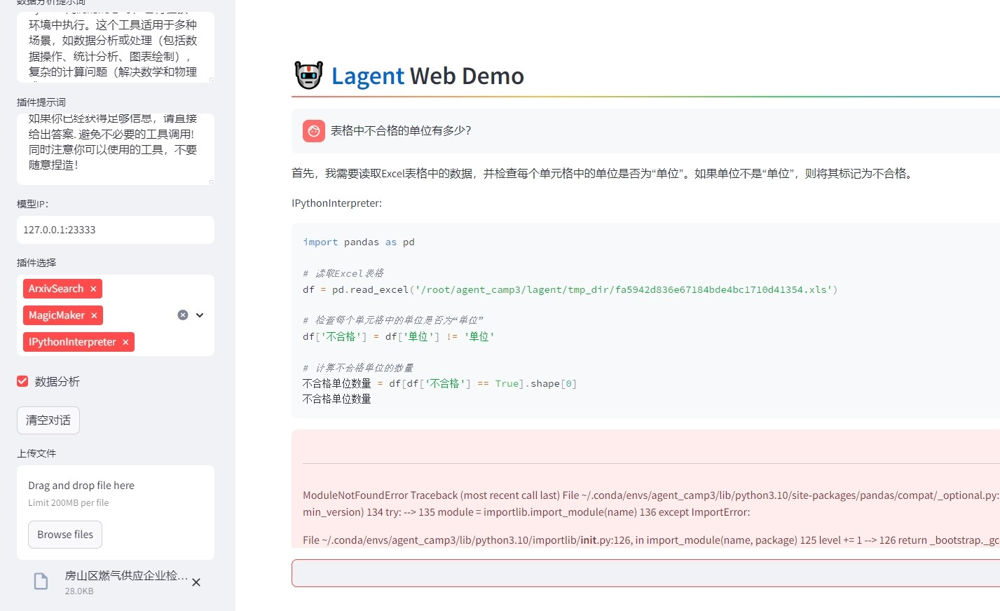

输入：帮我找出LeNet-5的原始论文

输出：
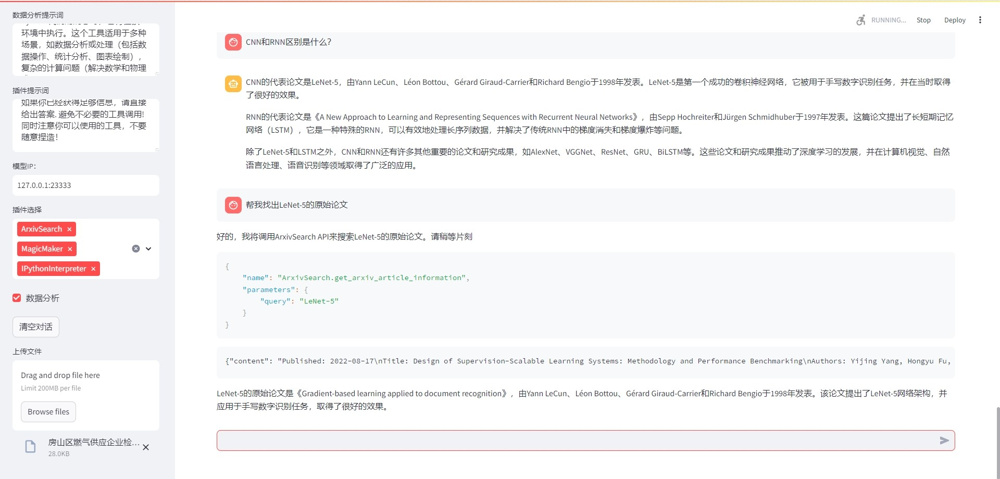

我们可以通过后台打印看到具体的调用情况，可以区分哪些是LLM自身回复，哪些是第三方工具回复

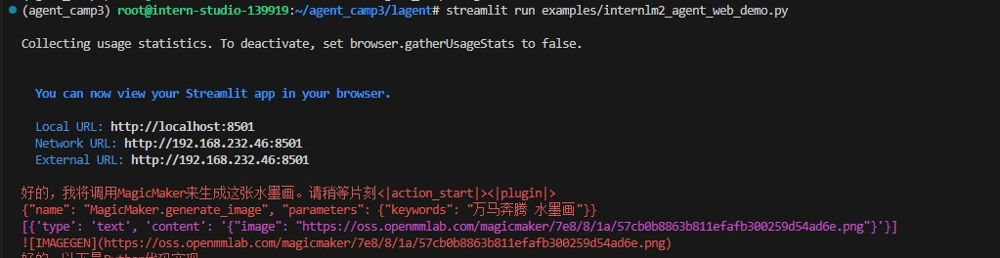

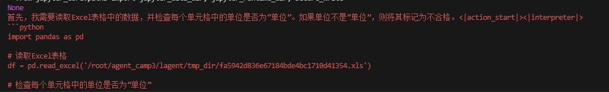

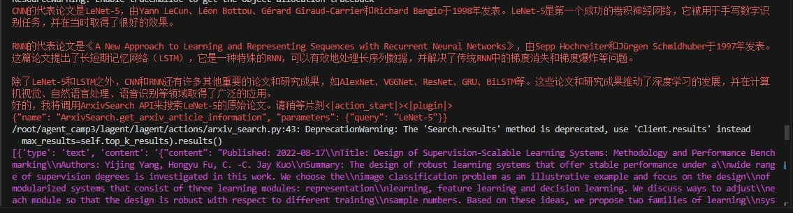