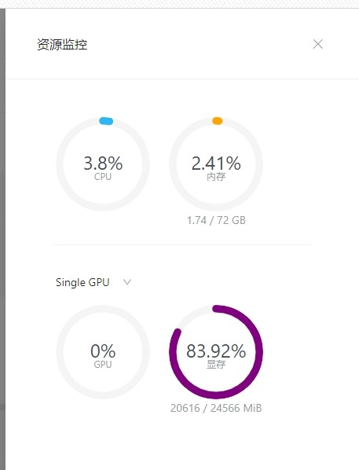
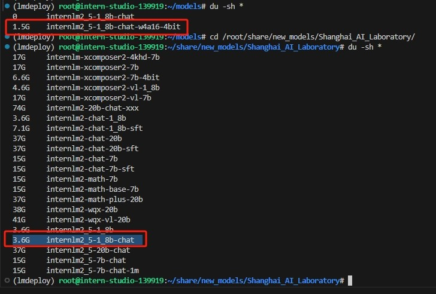
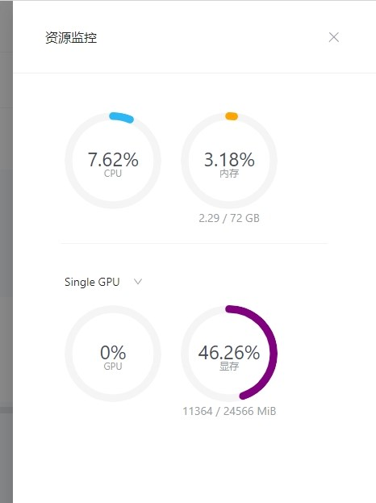
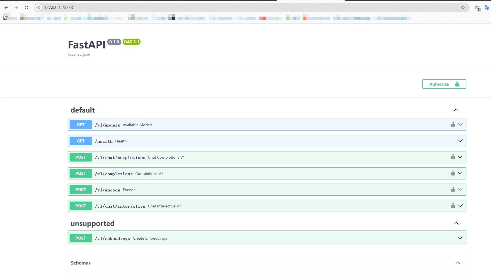
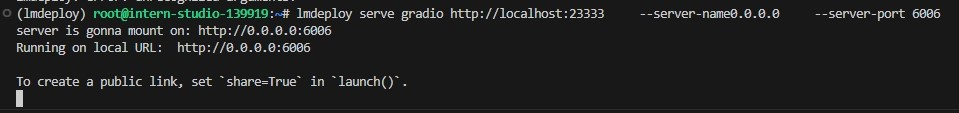
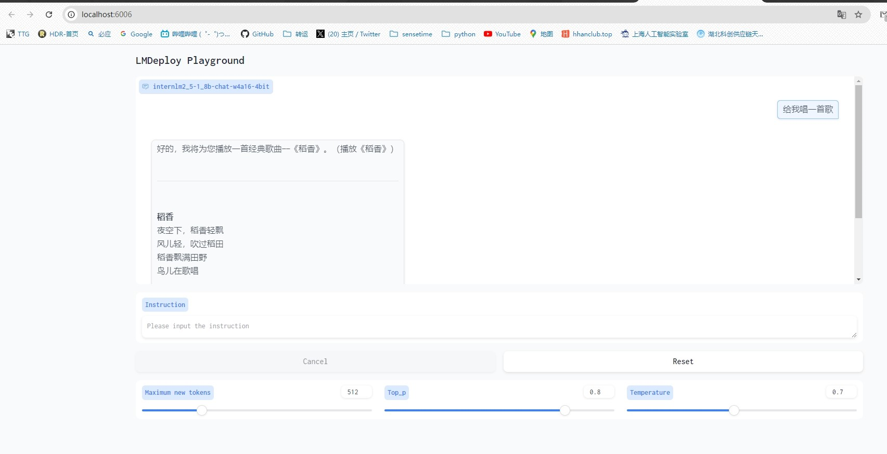
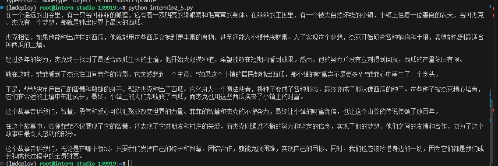
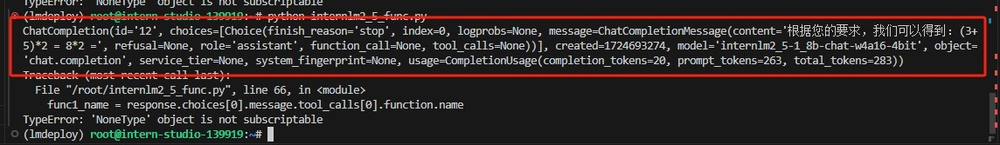

通过LMDeploy量化可以降低模型的推理成本和提高效率，下面将做测试
此处选用A100-80-30%资源测试，总计24GB显存

# 1、基础环境搭建

创建一个名为lmdeploy的conda环境
```commandline
conda create -n lmdeploy  python=3.10 -y
conda activate lmdeploy
conda install pytorch==2.1.2 torchvision==0.16.2 torchaudio==2.1.2 pytorch-cuda=12.1 -c pytorch -c nvidia -y
pip install timm==1.0.8 openai==1.40.3 lmdeploy[all]==0.5.3
```

完成1.8B模型软链接
```commandline
mkdir /root/models
ln -s /root/share/new_models/Shanghai_AI_Laboratory/internlm2_5-1_8b-chat /root/models
```

# 2、验证推理原始模型

```commandline
conda activate lmdeploy
lmdeploy chat /root/models/internlm2_5-7b-chat
```
可以在开发机资源配置查看显存占用：



共使用了约20.6GB显存，具体构成如下：

模型权重显存占用：1.8B * 2 = 3.6GB
kv cache占用：（24-3.6）*0.8 = 16.32GB
总计：3.6+16.32=19.92GB 约为20GB左右

# 3、W4A16量化与kv cache量化

W4A16含义如下：

W4：这通常表示权重量化为4位整数（int4）。这意味着模型中的权重参数将从它们原始的浮点表示（例如FP32、BF16或FP16，Internlm2.5精度为BF16）转换为4位的整数表示。这样做可以显著减少模型的大小。

A16：这表示激活（或输入/输出）仍然保持在16位浮点数（例如FP16或BF16）。激活是在神经网络中传播的数据，通常在每层运算之后产生。

运行如下代码进行量化：
```commandline
lmdeploy lite auto_awq \
   /root/models/internlm2_5-1_8b-chat \
  --calib-dataset 'ptb' \
  --calib-samples 128 \
  --calib-seqlen 2048 \
  --w-bits 4 \
  --w-group-size 128 \
  --batch-size 1 \
  --search-scale False \
  --work-dir /root/models/internlm2_5-1_8b-chat-w4a16-4bit
```

等待量化完成后可以在 /root/models 目录下得到量化后的模型，可以对比权重大小：



模型本身文件减少了很多

下面通过如下指令完成 W4A16量化与kv cache量化双压缩

```commandline
lmdeploy serve api_server \
    /root/models/internlm2_5-1_8b-chat-w4a16-4bit/ \
    --model-format awq \
    --quant-policy 4 \
    --cache-max-entry-count 0.4\
    --server-name 0.0.0.0 \
    --server-port 23333 \
    --tp 1
```

显存占用情况如下：



显存占用约11.3GB，具体构成如下：

模型权重显存占用(in4)：1.8B * 2 / 4= 0.9GB
kv cache占用：（24-0.9）*0.4 =  9.24GB
总计：0.9+9.24=10.14GB 约为11GB左右 符合预期

# 4、API开发

在上面的启动中，已经完成了到23333端口的API能力

端口映射后可以先在本地验证一下接口：


为方便交互，可启动一个 chat-web 界面

```commandline
lmdeploy serve gradio http://localhost:23333 \
    --server-name 0.0.0.0 \
    --server-port 6006
```



测试如下：



其他测试如下：



目测1.8B的模型无法理解乘法功能调用

