之前跑通了语言LLM的微调，现在测试视图大模型的微调，让模型学会网络梗图理解
此处选用A100-80-50%资源测试，总计40GB显存

# 1、基础环境搭建

创建一个名为xtuner的conda环境
```commandline
conda create --name xtuner python=3.10 -y
conda activate xtuner
# 安装一些必要的库
conda install pytorch==2.1.2 torchvision==0.16.2 torchaudio==2.1.2 pytorch-cuda=12.1 -c pytorch -c nvidia -y
# 安装其他依赖
apt install libaio-dev
pip install transformers==4.39.3
pip install streamlit==1.36.0
```

完成InternVL2-2B模型复制
```commandline
cd /root
mkdir -p model
cp -r /root/share/new_models/OpenGVLab/InternVL2-2B /root/model/
```

安装xtuner和LMDeploy
```commandline
# 创建一个目录，用来存放xtuner源代码
mkdir -p /root/InternLM/code
cd /root/InternLM/code
git clone -b v0.1.23  https://github.com/InternLM/XTuner
cd /root/InternLM/code/XTuner
pip install -e '.[deepspeed]'

#安装LMDeploy
pip install lmdeploy==0.5.3
```

# 2、准备微调数据集

我们这里使用huggingface上的zhongshsh/CLoT-Oogiri-GO据集，特别鸣谢～。

```commandline
@misc{zhong2023clot,
  title={Let's Think Outside the Box: Exploring Leap-of-Thought in Large Language Models with Creative Humor Generation},
  author={Zhong, Shanshan and Huang, Zhongzhan and Gao, Shanghua and Wen, Weushao and Lin, Liang and Zitnik, Marinka and Zhou, Pan},
  journal={arXiv preprint arXiv:2312.02439},
  year={2023}
}
```
数据集我们从官网下载下来并进行去重，只保留中文数据等操作。并制作成XTuner需要的形式。并已在share里，我们一起从share里挪出数据集。

```commandline
## 首先让我们安装一下需要的包
pip install datasets matplotlib Pillow timm

## 让我们把数据集挪出来
cp -r /root/share/new_models/datasets/CLoT_cn_2000 /root/InternLM/datasets/

```

在VScode左侧文件预览里面可以看到对应的图片，我们可以随机点开一张（此处我选的是第一张）
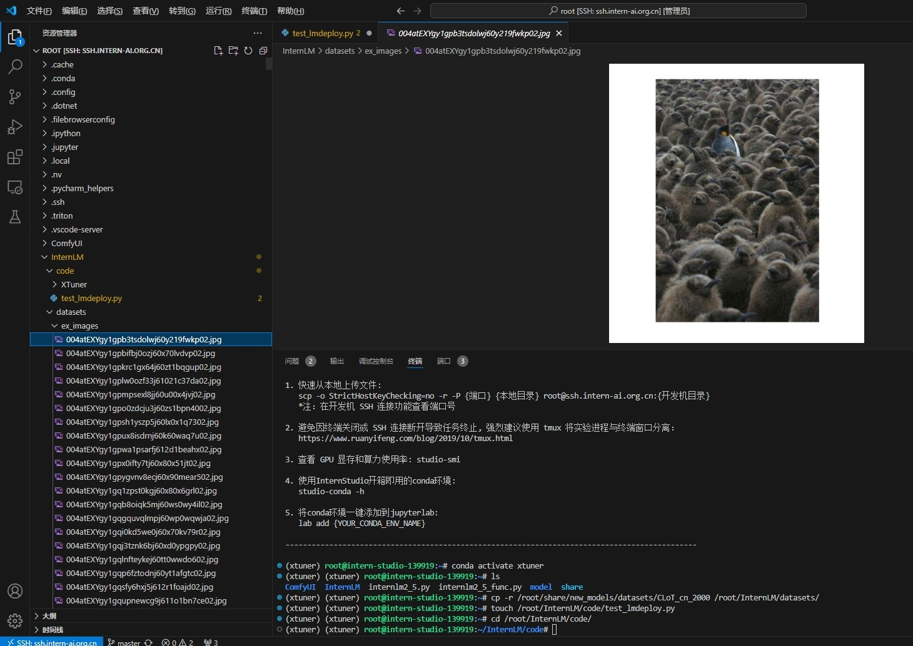


# 2、验证推理原始模型

编写一个py让原始模型推理测试一下

```commandline
touch /root/InternLM/code/test_lmdeploy.py
cd /root/InternLM/code/
```

test_lmdeploy.py编写如下：

```commandline
from lmdeploy import pipeline
from lmdeploy.vl import load_image

pipe = pipeline('/root/model/InternVL2-2B')

image = load_image('/root/InternLM/datasets/eximages/004atExYgy1gpb3tsdolwj60y219fwkp02.jpg') #替换图片绝对路径
response = pipe(('请你根据这张图片，讲一个脑洞大开的梗', image))
print(response.text)
```

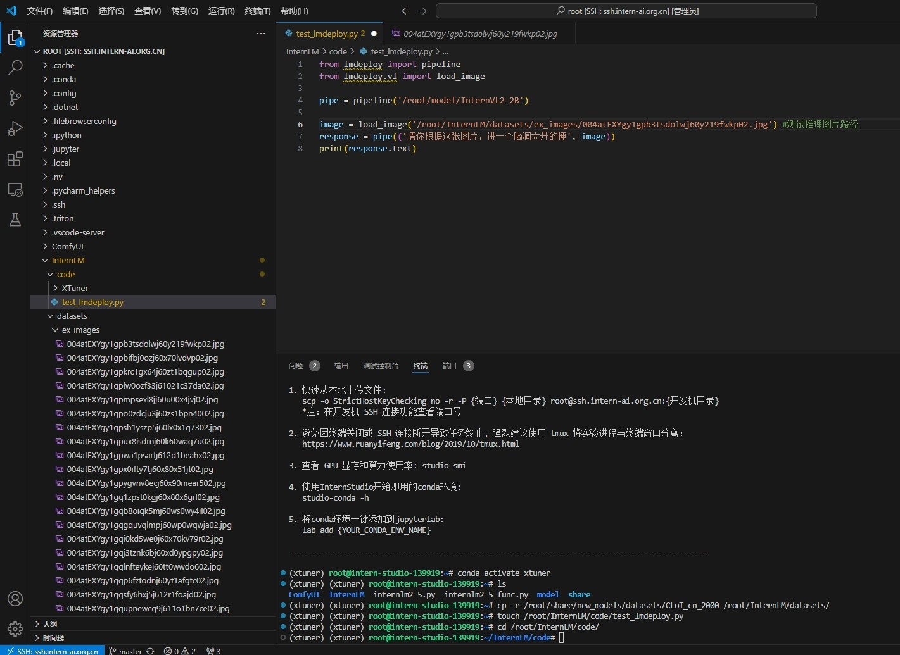

然后运行推理：

```commandline
python3 test_lmdeploy.py
```

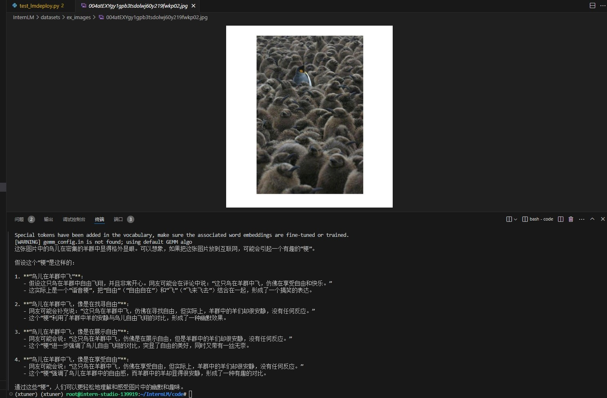

原始模型把小企鹅识别成羊群了，并没有明白这个梗


# 3、微调测试

在刚才的复制中已经把微调数据标注文件复制了，如下json文件：
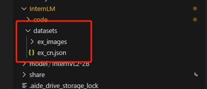

下面对应修改微调配置文件即可

找到如下文件：

```commandline
/root/InternLM/code/XTuner/xtuner/configs/internvl/v2/internvl_v2_internlm2_2b_qlora_finetune.py
```

复制如下：
(请注意##后提示说明)

```commandline
# Copyright (c) OpenMMLab. All rights reserved.
from mmengine.hooks import (CheckpointHook, DistSamplerSeedHook, IterTimerHook,
                            LoggerHook, ParamSchedulerHook)
from mmengine.optim import AmpOptimWrapper, CosineAnnealingLR, LinearLR
from peft import LoraConfig
from torch.optim import AdamW
from transformers import AutoTokenizer

from xtuner.dataset import InternVL_V1_5_Dataset
from xtuner.dataset.collate_fns import default_collate_fn
from xtuner.dataset.samplers import LengthGroupedSampler
from xtuner.engine.hooks import DatasetInfoHook
from xtuner.engine.runner import TrainLoop
from xtuner.model import InternVL_V1_5
from xtuner.utils import PROMPT_TEMPLATE

#######################################################################
#                          PART 1  Settings                           #
#######################################################################
# Model
path = '/root/model/InternVL2-2B'

# Data
data_root = '/root/InternLM/datasets/' ##根据实际目录修改
data_path = data_root + 'ex_cn.json'
image_folder = data_root
prompt_template = PROMPT_TEMPLATE.internlm2_chat
max_length = 6656

# Scheduler & Optimizer
batch_size = 4  # per_device
accumulative_counts = 4
dataloader_num_workers = 4
max_epochs = 6                  ##最大的轮次，越高训练时间越长
optim_type = AdamW
# official 1024 -> 4e-5
lr = 2e-5                       ##学习率配置
betas = (0.9, 0.999)
weight_decay = 0.05
max_norm = 1  # grad clip
warmup_ratio = 0.03

# Save
save_steps = 1000           ##保存模型的步数
save_total_limit = 1  # Maximum checkpoints to keep (-1 means unlimited)

#######################################################################
#            PART 2  Model & Tokenizer & Image Processor              #
#######################################################################
model = dict(
    type=InternVL_V1_5,
    model_path=path,
    freeze_llm=True,
    freeze_visual_encoder=True,
    quantization_llm=True,  # or False
    quantization_vit=False,  # or True and uncomment visual_encoder_lora
    # comment the following lines if you don't want to use Lora in llm
    llm_lora=dict(
        type=LoraConfig,
        r=128,
        lora_alpha=256,
        lora_dropout=0.05,
        target_modules=None,
        task_type='CAUSAL_LM'),
    # uncomment the following lines if you don't want to use Lora in visual encoder # noqa
    # visual_encoder_lora=dict(
    #     type=LoraConfig, r=64, lora_alpha=16, lora_dropout=0.05,
    #     target_modules=['attn.qkv', 'attn.proj', 'mlp.fc1', 'mlp.fc2'])
)

#######################################################################
#                      PART 3  Dataset & Dataloader                   #
#######################################################################
llava_dataset = dict(
    type=InternVL_V1_5_Dataset,
    model_path=path,
    data_paths=data_path,
    image_folders=image_folder,
    template=prompt_template,
    max_length=max_length)

train_dataloader = dict(
    batch_size=batch_size,
    num_workers=dataloader_num_workers,
    dataset=llava_dataset,
    sampler=dict(
        type=LengthGroupedSampler,
        length_property='modality_length',
        per_device_batch_size=batch_size * accumulative_counts),
    collate_fn=dict(type=default_collate_fn))

#######################################################################
#                    PART 4  Scheduler & Optimizer                    #
#######################################################################
# optimizer
optim_wrapper = dict(
    type=AmpOptimWrapper,
    optimizer=dict(
        type=optim_type, lr=lr, betas=betas, weight_decay=weight_decay),
    clip_grad=dict(max_norm=max_norm, error_if_nonfinite=False),
    accumulative_counts=accumulative_counts,
    loss_scale='dynamic',
    dtype='float16')

# learning policy
# More information: https://github.com/open-mmlab/mmengine/blob/main/docs/en/tutorials/param_scheduler.md  # noqa: E501
param_scheduler = [
    dict(
        type=LinearLR,
        start_factor=1e-5,
        by_epoch=True,
        begin=0,
        end=warmup_ratio * max_epochs,
        convert_to_iter_based=True),
    dict(
        type=CosineAnnealingLR,
        eta_min=0.0,
        by_epoch=True,
        begin=warmup_ratio * max_epochs,
        end=max_epochs,
        convert_to_iter_based=True)
]

# train, val, test setting
train_cfg = dict(type=TrainLoop, max_epochs=max_epochs)

#######################################################################
#                           PART 5  Runtime                           #
#######################################################################
# Log the dialogue periodically during the training process, optional
tokenizer = dict(
    type=AutoTokenizer.from_pretrained,
    pretrained_model_name_or_path=path,
    trust_remote_code=True)

custom_hooks = [
    dict(type=DatasetInfoHook, tokenizer=tokenizer),
]

# configure default hooks
default_hooks = dict(
    # record the time of every iteration.
    timer=dict(type=IterTimerHook),
    # print log every 10 iterations.
    logger=dict(type=LoggerHook, log_metric_by_epoch=False, interval=10),
    # enable the parameter scheduler.
    param_scheduler=dict(type=ParamSchedulerHook),
    # save checkpoint per `save_steps`.
    checkpoint=dict(
        type=CheckpointHook,
        save_optimizer=False,
        by_epoch=False,
        interval=save_steps,
        max_keep_ckpts=save_total_limit),
    # set sampler seed in distributed evrionment.
    sampler_seed=dict(type=DistSamplerSeedHook),
)

# configure environment
env_cfg = dict(
    # whether to enable cudnn benchmark
    cudnn_benchmark=False,
    # set multi process parameters
    mp_cfg=dict(mp_start_method='fork', opencv_num_threads=0),
    # set distributed parameters
    dist_cfg=dict(backend='nccl'),
)

# set visualizer
visualizer = None

# set log level
log_level = 'INFO'

# load from which checkpoint
load_from = None

# whether to resume training from the loaded checkpoint
resume = False

# Defaults to use random seed and disable `deterministic`
randomness = dict(seed=None, deterministic=False)

# set log processor
log_processor = dict(by_epoch=False)
```

配置好后进行保存。


开启微调测试：

```commandline
cd XTuner

NPROC_PER_NODE=1 xtuner train /root/InternLM/code/XTuner/xtuner/configs/internvl/v2/internvl_v2_internlm2_2b_qlora_finetune.py  --work-dir /root/InternLM/work_dir/internvl_ft_run_8_filter  --deepspeed deepspeed_zero1

```

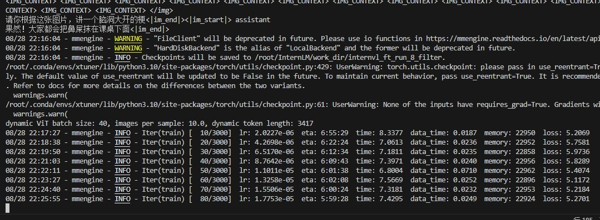

3000步微调大概需要6H，注意时间哦

训练结束后，可以在

'/root/InternLM/work_dir/internvl_ft_run_8_filter'

下看到模型文件，参考如下：

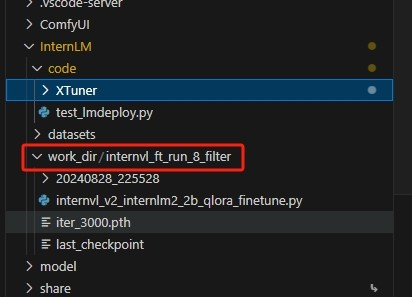

# 4、合并模型并测试
此处训练的是Lora模型，并非全部参数，需要将Lora与原始模型进行合并

```commandline
cd XTuner
# transfer weights
python3 xtuner/configs/internvl/v1_5/convert_to_official.py xtuner/configs/internvl/v2/internvl_v2_internlm2_2b_qlora_finetune.py /root/InternLM/work_dir/internvl_ft_run_8_filter/iter_3000.pth /root/InternLM/InternVL2-2B/
```

等待合并结束后,可以在 /root/InternLM 下 得到新的VL模型

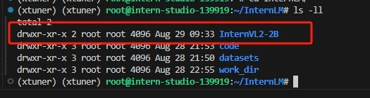

我们可以用之前的推理脚本，修改模型指向重新推理测试

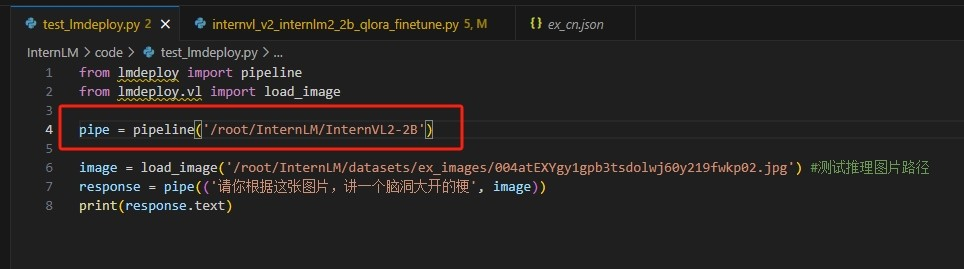

运行测试：
```commandline
python3 test_lmdeploy.py
```

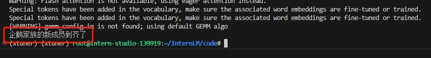

已经理解这个图片 ，但是这个图是测试集的，我们再找一张网图测试泛化能力

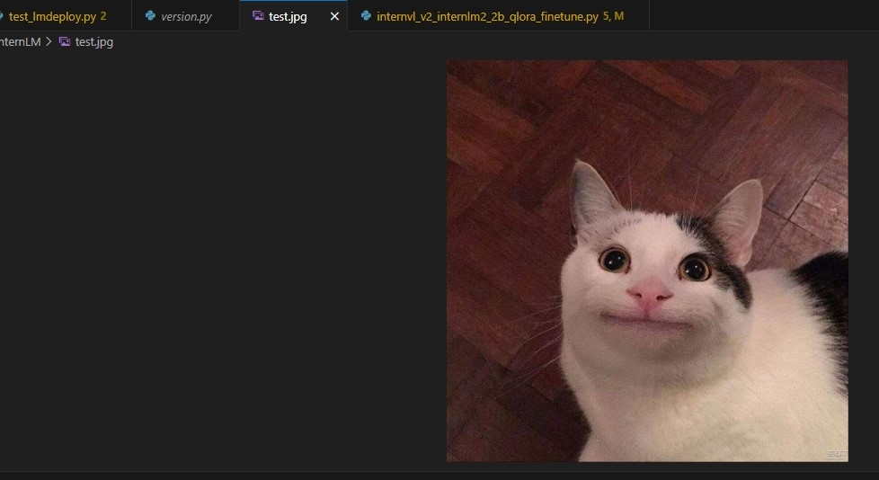

修改推理图片指向

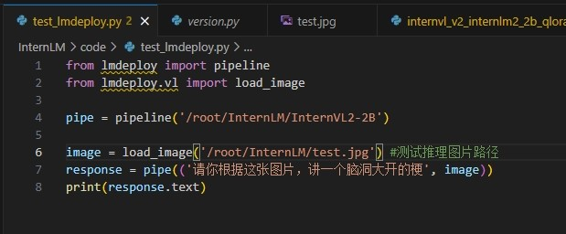

运行推理测试：

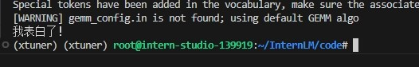

ememem 表白后被发好人卡的尴尬微笑。。。。


# 5、后记：不同学习率的不严谨对比

将学习率改为4e-3后，会发现学习率增大，导致收敛幅度变快，但是精度下降，核心原因就是找不到更精准的收敛区域。
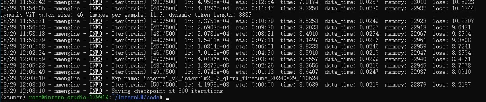


