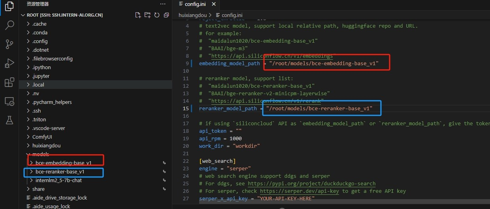
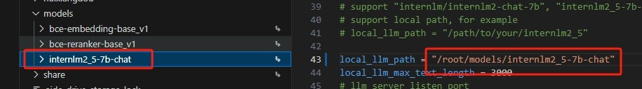
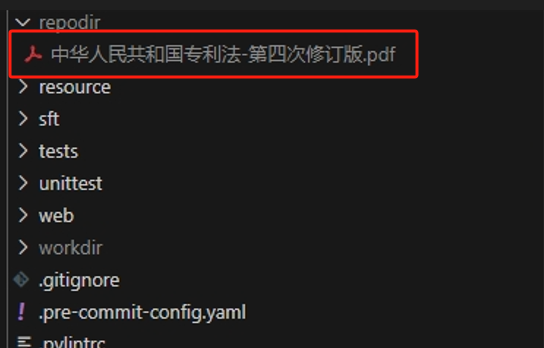
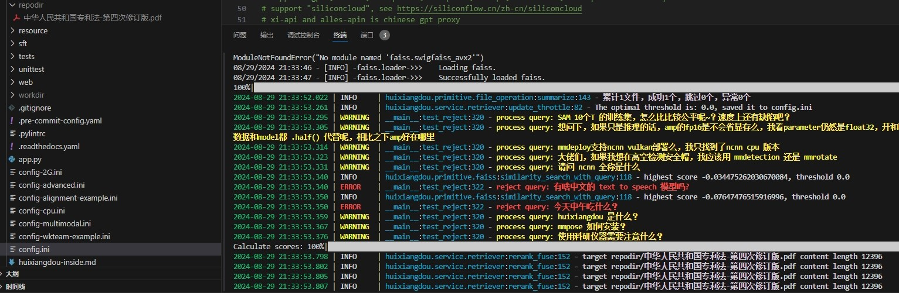
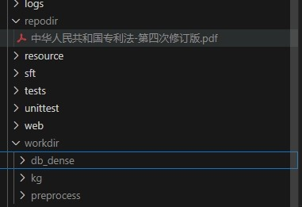
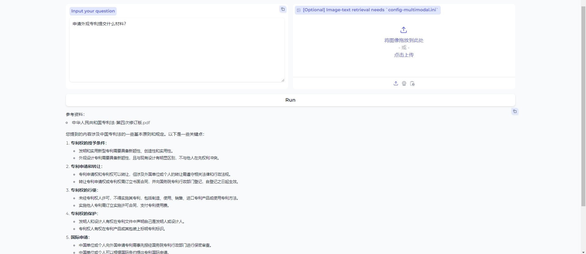
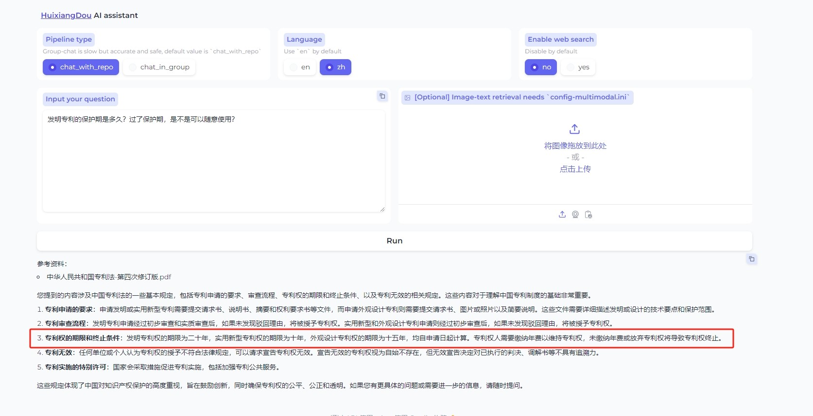
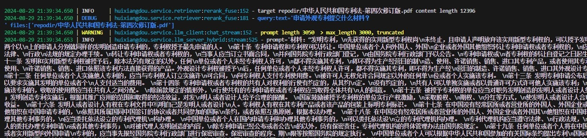

茴香豆 是由书生·浦语团队开发的一款开源、专门针对国内企业级使用场景设计并优化的知识问答工具。

下面将基于书生2.5-7B进行测试（配置A100-80GB-30%资源）

# 1、基础环境搭建

创建一个名为huixiangdou的conda环境

```commandline
conda create --name huixiangdou python=3.10 -y
conda activate huixiangdou
# 安装一些必要的库
apt update
apt install python-dev libxml2-dev libxslt1-dev antiword unrtf poppler-utils pstotext tesseract-ocr flac ffmpeg lame libmad0 libsox-fmt-mp3 sox libjpeg-dev swig libpulse-dev

# 克隆代码仓库
cd /root
git clone https://github.com/internlm/huixiangdou && cd huixiangdou
git checkout 79fa810

# 安装其他依赖
pip install BCEmbedding==0.1.5 cmake==3.30.2 lit==18.1.8 sentencepiece==0.2.0 protobuf==5.27.3 accelerate==0.33.0
pip install -r requirements.txt
```
# 2、模型文件准备
在开发机内建立软连接

```commandline
# 创建模型文件夹
cd /root && mkdir models

# 复制BCE模型
ln -s /root/share/new_models/maidalun1020/bce-embedding-base_v1 /root/models/bce-embedding-base_v1
ln -s /root/share/new_models/maidalun1020/bce-reranker-base_v1 /root/models/bce-reranker-base_v1

# 复制大模型参数（此处使用的是能力更强的2.5-7B模型）
ln -s /root/share/new_models/Shanghai_AI_Laboratory/internlm2_5-7b-chat /root/models/internlm2_5-7b-chat
```

# 3、修改配置文件

定位打开“/root/huixiangdou/config.ini”

修改第9、15、43行，参考如下（要和本地的文件对应上）：





# 4、创建知识库目录和向量目录

分别建立两个目录用来保存文件和向量化结果

```commandline
cd /root/huixiangdou
mkdir repodir   #创建知识库目录
mkdir workdir   #创建向量目录
```

我找到一份《中华人民共和国专利法-第四次修订版.pdf》作为知识库，复制到repodir目录下，如图：


然后运行脚本进行文本向量化分析

```commandline
python3 -m huixiangdou.service.feature_store
```

等待运行：


完成后，可以发现在workdir目录下新增了不少文件，这些文件即为向量化后的分割文件



# 5、Gradio界面测试

运行茴香豆助手的服务器端，输入下面的命令，启动茴香豆 Web UI：

```commandline
cd /root/huixiangdou
python3 -m huixiangdou.gradio
```

启动完成后，可打开127.0.0.1:7860 进行测试

前端问题：


前端问题：


我们也可以同步在后端看对应的模型返回内容日志

